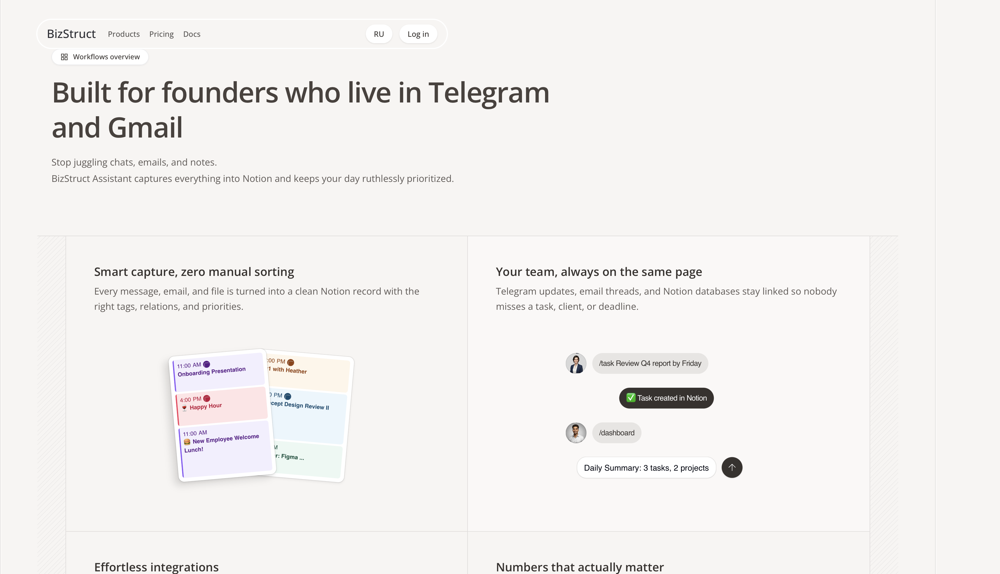
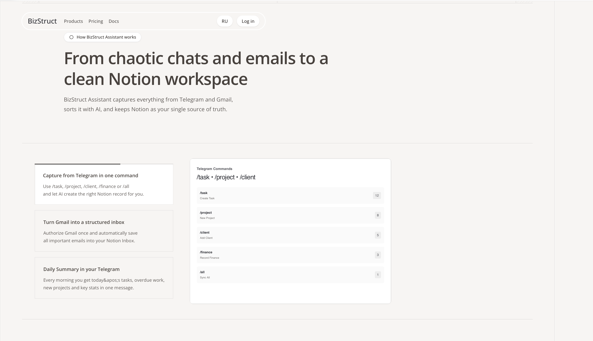

# BizStruct

### From chaos to clarity — your business control center in Telegram and Notion

BizStruct Assistant captures everything from Telegram and Gmail, sorts it with AI, and keeps Notion as your single source of truth.

[Website](#) • [Documentation](/documentation) • [Telegram Bot](https://t.me/Bizstruct_bot) • [GitHub](#)

---

## Product Vision

**Stop juggling apps. Start organizing your business.**

Business owners live in Telegram and Gmail, but their work lives scattered across dozens of apps, notes, and inboxes. BizStruct changes that by turning chaotic chats and emails into a clean, organized Notion workspace.

**We believe** that organization shouldn't require switching between apps. Capture tasks, clients, projects, and finances right from Telegram using simple commands. Let AI classify and structure everything automatically. Wake up to a smart daily summary that tells you exactly what matters.

**The result?** One unified workspace where everything is captured, classified, and organized — automatically. Your business, structured.

---

## Core Capabilities

### 📱 **Telegram Integration**
**Capture everything without leaving Telegram**

Use simple commands like `/task`, `/project`, `/client`, `/finance`, or `/all` to instantly create structured records in Notion. No app switching, no manual data entry — just capture and move on.

- **Smart commands** — `/task Review Q4 report by Friday`
- **AI auto-classification** — `/all` command intelligently categorizes your message
- **Instant sync** — Records appear in Notion immediately
- **Works where you work** — No context switching needed

### 📧 **Gmail → Notion Inbox**
**Never lose important emails again**

Connect Gmail once, and all important emails automatically sync to your Notion Inbox. AI classifies content, links emails to related tasks or clients, and keeps everything searchable in one place.

- **Automatic capture** — All emails sync to Notion Inbox
- **AI classification** — Intelligent categorization of email content
- **Smart linking** — Emails linked to tasks, projects, or clients
- **Unified search** — Find any email in Notion instantly

### 🤖 **AI-Powered Organization**
**Intelligent classification at scale**

Our AI understands context, extracts key information, and creates structured records with proper tags and relations. It learns from your usage patterns and gets smarter over time.

- **Context understanding** — Understands intent from your messages
- **Information extraction** — Dates, amounts, priorities automatically detected
- **Smart relations** — Links between tasks, projects, and clients
- **Learning system** — Improves accuracy with usage

### 📊 **Daily Summary**
**Start every morning with clarity**

Receive a smart morning report in Telegram with today's tasks, overdue items, new projects, key metrics, and recent client activity. Delivered at your preferred time, every day.

- **Today's priorities** — What needs your attention
- **Overdue alerts** — Never miss a deadline
- **Business metrics** — Key stats at a glance
- **Client activity** — Recent interactions and updates

### 🗄️ **Structured Notion Workspace**
**Your data, your control**

All captured information automatically organizes into clean Notion databases: Tasks, Projects, Clients, Finances, and Inbox. Full control over templates, views, and structure.

- **Automatic database creation** — Set up during onboarding
- **Smart relations** — Connected tasks, projects, and clients
- **Customizable views** — Filter and organize your way
- **Full ownership** — All data in your Notion workspace

---

## Why BizStruct

### 🎯 **No-code first**
Capture and organize without any technical setup. Simple commands, instant results.

### 🧩 **Modular system**
Each feature works independently. Use Telegram capture, Gmail sync, daily summaries — or all together.

### ⚡ **Real-time sync**
Everything syncs instantly. No delays, no manual refresh needed.

### 📈 **Built for scale**
Handles hundreds of tasks, emails, and projects without breaking a sweat.

### 🔒 **Privacy-first**
Your data stays in your Notion workspace. We never store your information on our servers.

### 🤖 **AI-native architecture**
Built from the ground up with AI at the core. Not bolted on as an afterthought.

---

## UI Preview

### Homepage
The main landing page showcases the product with interactive dashboard visualizations that demonstrate how BizStruct transforms chaos into organized structure.


### Features Page
Comprehensive breakdown of all capabilities with detailed command examples and use cases.


### Interactive Dashboard
Real-time Notion workspace preview showing how captured items appear in organized databases.



### Pricing & Plans
Simple, transparent pricing with lifetime access. No subscriptions, no hidden fees.



### Documentation
Complete setup guides and feature documentation with step-by-step instructions.


---

## Tech Stack

**Frontend:** Next.js 14 / React 19 / TypeScript / Tailwind CSS 4  
**UI Components:** Radix UI / Lucide Icons  
**Styling:** Tailwind CSS / CSS Variables  
**Animations:** Intersection Observer API / CSS Transitions  
**Language:** LocalStorage API / Custom Events  
**Analytics:** Vercel Analytics  
**Hosting:** Vercel  
**Fonts:** Open Sans / Instrument Serif

---

## Pages Overview

| Route | Description |
|-------|-------------|
| `/` | Product landing page with hero, features, and interactive demos |
| `/features` | Detailed feature breakdown with command examples |
| `/pricing` | Pricing plans and lifetime access information |
| `/documentation` | Setup guides, commands reference, and usage instructions |

---

## Visual Identity

### Design Philosophy
**Editorial elegance meets product functionality**

BizStruct's design language draws inspiration from premium editorial layouts while maintaining the clarity and efficiency required for a productivity tool.

### Color System
- **Background:** Warm beige (`#F7F5F3`) creates a calm, professional atmosphere
- **Primary:** Dark brown (`#37322F`) ensures excellent readability
- **Accent:** Brown tones (`#5D4E37`) for highlights and CTAs
- **Borders:** Subtle grays (`rgba(55,50,47,0.12)`) for separation without distraction

### Typography Hierarchy
- **Headings:** Instrument Serif — elegant, editorial feel
- **Body:** Open Sans — clean, readable, professional
- **Weights:** 300-800 scale for clear hierarchy
- **Responsive sizing:** Adapts seamlessly from mobile to desktop

### Motion & Micro-interactions
- **Scroll animations:** Elements fade in and slide up on scroll
- **Card transitions:** Smooth rotation and fade effects
- **Progress indicators:** Visual feedback for auto-rotating content
- **Hover states:** Subtle scale and shadow changes

### Layout System
- **Left-aligned layout:** Unique editorial-style alignment
- **Wide containers:** 1400px (desktop) / 1600px (XL screens)
- **Responsive breakpoints:** Mobile-first approach
- **Decorative elements:** Subtle vertical lines and patterns

### Component Design
- **Capsule navigation:** Rounded pill-style navigation bar
- **Card-based sections:** Clean separation between content blocks
- **Badge components:** Rounded pills for labels and categories
- **Interactive dashboards:** Notion-style data visualizations

---

## Quick Start

```bash
# Clone the repository
git clone https://github.com/bizstruct/web.git

# Navigate to project directory
cd bizstruct-web

# Install dependencies
npm install
# or
pnpm install

# Run development server
npm run dev
# or
pnpm dev

# Open http://localhost:3000
```

### Build for Production

```bash
npm run build
npm start
```

### Environment Setup

No environment variables required for the website. The site is fully static and ready to deploy.

---

## Roadmap

### Now
- ✅ Multi-language support (EN/RU)
- ✅ Interactive dashboard visualizations
- ✅ Responsive design for all devices
- ✅ Scroll-triggered animations
- ✅ Complete documentation

### Next
- 🔄 Advanced analytics dashboard
- 🔄 Custom Notion template builder
- 🔄 Team collaboration features
- 🔄 API integration examples
- 🔄 More language support

### Future
- 📅 Mobile app companion
- 📅 Browser extension for Gmail
- 📅 Slack integration
- 📅 Advanced AI customization
- 📅 White-label options

---

## Contributing

We welcome contributions! For development guidelines:

- TypeScript is required
- Follow existing code style
- Write descriptive commit messages
- Test on multiple screen sizes
- Ensure accessibility compliance

---

## License

This project is proprietary software. All rights reserved.

---

---

## Built by BizStruct Team

**Designed with obsession for clarity and organization.**

Transform chaos into structure. One command at a time.

[Website](#) • [Documentation](/documentation) • [Telegram Bot](https://t.me/Bizstruct_bot) • [Support](mailto:support@bizstruct.com)
